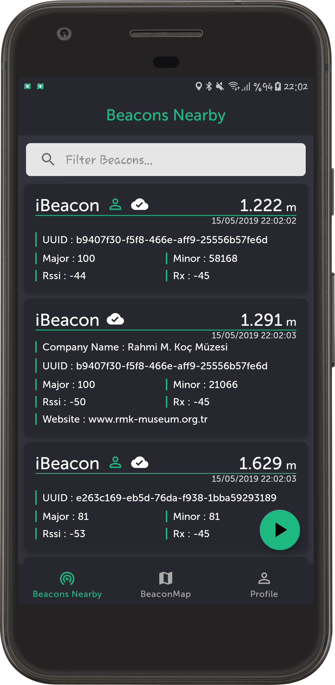
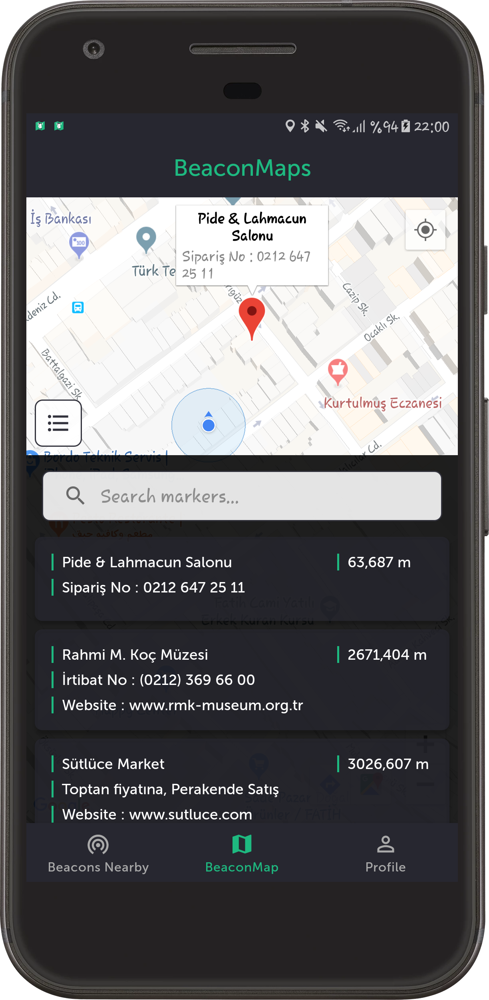
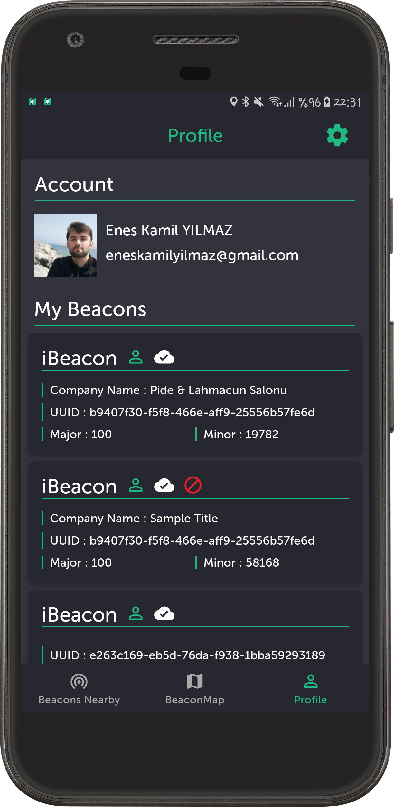

# BeaconMaps
Lisans Bitirme Projesi olarak yaptığım Android uygulamasıdır.

### Projenin Amacı
Firma bağımsız bir beacon uygulaması tasarlayarak 
kişi ve kurumların mikro konum temelindeki reklam ve tanıtım ihtiyaçlarının giderilmesidir. 

### Projenin Özeti
Beacon teknolojisini kullanarak kendilerine özel uygulama geliştirmek veya bu teknolojiden 
faydalanmak isteyen kullanıcılar kod yazmadan, yazdırmadan bu teknolojiyi kullanabilmeleri mümkün değildir. 
Bu teknoloji kullanabilmeleri için Android veya IOS ortamında bir proje yapabilecek kadar bilgiye sahip 
olmaları veya bir firmaya yaptırmaları gereklidir. 

Projemizde bu eksikliği gidermeyi hedefliyoruz.
Bir kullanıcı veya kurum, çevresinde bulunan beaconları kullanmak istediği zaman BeaconMaps uygulamamız 
vasıtasıyla çevrede bulunan beaconları, bu beaconların lokasyonlarını, kime ait olduklarını, 
varsa kullanıcının web sitesini, beacon kapsama alanına girerse aldığı bildirim mesajı ile çevreye 
yaydığı bilgileri görebilir veya bu bilgileri kendi beaconına ekleyebilir.

### Uygulama İçi Ekran Görüntüleri

  
  
  

